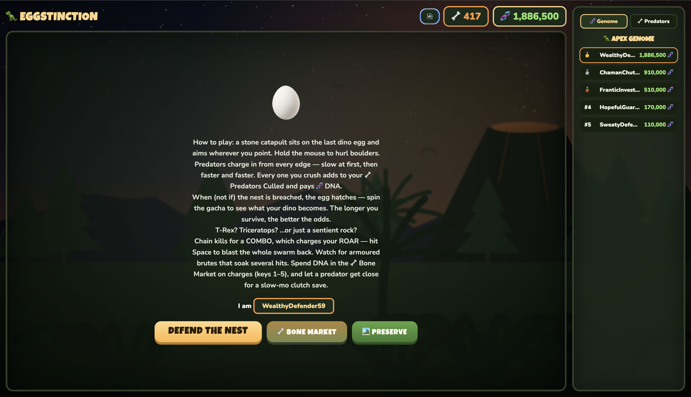

# 🦖 EGGSTINCTION

> Defend the last dinosaur egg. Hatch a legend. Or a rock.



So here's the pitch: it's 65 million years ago, everything is trying to eat the last dino egg, and the only thing standing between extinction and a thriving Jurassic dynasty is **you and a catapult**.

You hold the line as long as you can. The swarm always wins eventually — that's not a spoiler, it's the whole point — and the second they crack the nest, the egg hatches into *something*. Maybe a valley-ruling **T-Rex**. Maybe, if you bailed after one second, a **sentient rock**. The longer you survived, the better your luck.

Then you take the DNA you earned and either climb the global leaderboard… or blow it all building your own little prehistoric park. Your call.

There are two live leaderboards (real-time, powered by [Convex](https://convex.dev)): **🦖 Apex Genome** for the richest gene pool, and **🦴 Pest Exterminator** for the most predators flattened.

---

## 🎮 How it actually plays

Point with your mouse, **hold to hurl boulders**, and don't let anything touch the egg.

- The predators come in **waves**, and they get nastier as you go. Quick little **runts**, armored **brutes** that shrug off hits, **flyers** you have to lead, **chargers** that wind up and dash, **splitters** that pop into two when they die — and every third wave, an **Alpha** boss with a health bar and a temper.
- **Chain your kills** to build a combo, which charges your **ROAR**. When it's full, smash **Space** and a shockwave blasts the whole swarm off the screen. It's your "oh god everything at once" button, and it feels great.
- Let a predator get *right* up next to the egg and time slows to a crawl — **slow-mo** for the clutch save.
- Every kill pays **DNA 🧬** and feeds your kill count. Spend the DNA in the **🦴 Bone Market** on one-use charges (rapid fire, triple shot, tar pit, piercing rounds, a shield) — fire them mid-run with keys **1–5** — or on **permanent upgrades** that carry across every future run: more damage, faster arms, a beefier roar, extra egg HP, fatter DNA payouts.
- When the nest finally falls, the egg **hatches** and a slot machine decides your dino's fate. Survive longer → better odds. Then you go again.

> 💡 It all compounds: surviving longer means more kills, more DNA, *and* a better hatch — but the swarm never stops speeding up. There's no winning here. Only a high score and the slow realization that you needed just one more boulder.

Oh, and there's sound — synthesized from scratch, no audio files — with a mute button up top if your coworkers are nearby.

## 🏞️ The Preserve

Combat's only half of it. Hit **🏞️ Preserve** from the menu and you get a sunny, peaceful Cretaceous sandbox to decorate with everything you've earned. Drop in ferns, palms, ponds, boulders, nests — and the good stuff: a brontosaurus craning over the trees, a stegosaurus, a triceratops, your very own T-Rex on the lawn.

Pick a prop, click to place, drag to rearrange, delete what you don't like. It all saves. It's the cozy reward for all that carnage — and a genuinely tempting reason to *not* spend your DNA chasing the leaderboard.

---

## ▶️ Run it yourself

```bash
npm install
npm run dev        # playable right away — offline mode, scores saved locally
```

That's it. Offline mode stashes your DNA, kills, upgrades and preserve in `localStorage`, so the whole game works before you ever touch a backend. The leaderboards just say "offline" until you go live.

### 🌍 Going live (global leaderboards)

```bash
npx convex dev     # links/creates your Convex deployment, runs codegen,
                   # and writes VITE_CONVEX_URL to .env.local
```

Keep `npx convex dev` running in one terminal and `npm run dev` in another. Restart Vite once after the first link so it picks up `.env.local`, and the leaderboard panel quietly switches itself from "offline" to the live global top-10.

---

## 🥚 What can hatch?

Twenty possibilities, from "generational triumph" to "we don't talk about it at Thanksgiving":

| Hatchling | Genome Value |
|---|---|
| 🦖 Tyrannosaurus Rex | +2,000,000 |
| 🐊 Spinosaurus | +1,000,000 |
| 🦅 Quetzalcoatlus | +750,000 |
| 🦕 Triceratops | +500,000 |
| 🦖 Velociraptor | +420,000 |
| 🐢 Ankylosaurus | +300,000 |
| 🦎 Stegosaurus | +250,000 |
| 🦖 Allosaurus | +200,000 |
| 🐊 Baryonyx | +150,000 |
| 🐦 Gallimimus | +80,000 |
| 🦕 Iguanodon | +45,000 |
| 🦕 Parasaurolophus | +30,000 |
| 🐔 Compsognathus | +10,000 |
| 🦤 The Dodo | −30,000 |
| 🦎 Dimetrodon | −50,000 |
| 🐛 Trilobite | −80,000 |
| 🐚 Ammonite | −150,000 |
| 🪳 Just a Cockroach | −250,000 |
| 🦟 The Amber Mosquito | −400,000 |
| 🪨 A Sentient Rock | −666,000 |

The roll happens **on the server** so nobody can quietly forge themselves a T-Rex — the client just animates whatever the server already decided.

**The odds aren't fixed, either.** How long you survive (plus your kills) bends the whole table toward the apex species. Mathematically, each outcome's weight gets scaled by `weight · exp(TILT · luck · goodness)` — `luck` climbs from 0 → 1 over about 60 seconds or 100 kills, `goodness` is the payout normalized to ±1. Translation: a one-second panic run rolls the base table, while a long, brutal stand can make the legends roughly **9× more likely** and the dead ends nearly vanish. Earn your T-Rex.

---

## 🏗️ Under the hood

Plain React + Vite on the front, Convex on the back. The whole thing is hand-rolled Canvas2D — no game engine, no sprite sheets, every dino and fern drawn with paths.

| Piece | Where it lives | What it does |
|---|---|---|
| Game loop | `src/game/engine.js` | Canvas2D + requestAnimationFrame: waves, bosses, six predator types, combo/ROAR, slow-mo, hit-stop, the works |
| Backdrop | `src/game/backdrop.js` | The animated 65-mya menu scene — volcano, parallax jungle, meteors, lightning |
| The Preserve | `src/game/preserve.js` | Build-your-own diorama: place/drag/delete, depth-sorted rendering |
| Sound | `src/game/sound.js` | Procedural Web Audio SFX + ambient music, zero asset files |
| App shell | `src/App.jsx` | `menu → playing → rolling → result` plus pause, market, and preserve overlays |
| Server | `convex/leaderboard.ts` | Authoritative gacha roll, DNA economy, upgrades, leaderboards, preserve saves |
| Schema | `convex/schema.ts` | One `players` table, indexed by id / Genome / kills |

New fields are all optional, so older player docs keep working without a migration. `convex/_generated/` is produced by `npx convex dev`.

---

Built for fun, slightly cursed, and genuinely hard to put down once the boss waves start. Go defend your egg. 🥚
